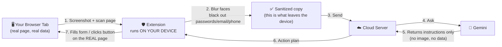

# SIH26171 — Privacy Browser Agent

> An AI agent that can see and control your browser — without ever sending your face, passwords, or other sensitive on-screen data to the cloud.

**SIH Problem Statement:** On-device Visual Perception for Light-weight Browser Agents (Indian Space Research Organisation / Dept. of Space) · Finale: 20 September 2026

---

## The 30-second pitch

AI agents that can look at your screen and act for you (fill forms, click buttons, navigate pages) are becoming common. The problem: to be smart enough to be useful, they usually run in the cloud — which means your **entire screen** gets uploaded to someone else's server. Your face on a webcam feed. Your password field. Your email. Everything.

**Our extension is a privacy checkpoint that sits between your screen and the cloud.** It looks at the page *on your own device first*, automatically blurs faces and blacks out password/email/phone fields, and only sends that **already-safe** version to the cloud AI. The cloud AI is still smart enough to understand the page and tell the browser what to do — it just never sees the sensitive parts in the first place.



The cloud never sees step 1. It only ever sees the output of step 2.

---

## How to demo this to judges (script)

You don't need to explain any code. Just do this, in order:

1. **Have the server running** before you walk up (`cd server && npm run dev`), and the demo page open at `http://localhost:3000/demo/index.html` with the extension loaded.
2. Point at the page: *"This is a normal signup form — name, email, phone, password, and a profile photo."*
3. (Optional, for extra impact) Click **Choose File** and upload any real photo live, right in front of them.
4. Click **▶ Run Full Agent Pipeline**. Say: *"An AI model is now looking at this page — running entirely on this laptop, not in the cloud."* (First run takes ~10–20s to load the on-device model; it's instant after that.)
5. Watch the form fill itself. Say: *"That's the AI understanding the page and filling it in — completely on its own."*
6. Scroll to **"Real Redacted Image (actually sent to Gemini)"**. This is the killer moment. Say: *"Here's the exact image that left this laptop and went to the cloud AI. Face — blurred. Password, email, phone number — gone. The AI in the cloud saw this, never the real thing, and it was still able to help."*
7. Click **⬇ Download full-resolution PNG** if anyone wants to inspect it closely.

**One line to close on:** *"You get the convenience of a cloud AI assistant, without giving up your privacy to get it."*

---

## The problem, in plain language

Modern "AI agents" that browse the web for you need to *see* the page to know what to do — much like a human assistant would. The easiest way to build one is to take a screenshot and send it to a powerful AI model running on a server somewhere. That's simple, but it means:

- Every screenshot could contain a password, a bank balance, a face, a medical form — anything visible gets uploaded.
- You have to trust that server completely, forever, with everything you ever do near that browser tab.

A phone or laptop today is powerful enough to run small AI models *locally* — but not powerful enough to run the big, capable models that do the actual reasoning. So the real question is: **what's the minimum information the cloud actually needs to see to be useful, and can we strip out everything else before it ever leaves the device?**

## Our solution, in plain language

Split the work into two halves:

- **On the device (private, fast, small model):** look at the screen, figure out what's sensitive (faces, password fields, email fields, phone numbers), and erase just those parts.
- **In the cloud (powerful, capable model):** look at the *already-safe* version and decide what actions to take (click this, type that) — without ever needing to see the sensitive parts to do its job.

The insight that makes this work: an AI doesn't need to *read* your password to know "this is a password field, don't touch it" — it just needs to know a password field exists there. So we send the AI a censored screenshot plus a simple list of what's on the page (buttons, fields, labels) — enough structure to reason about the page, nothing that leaks what you typed.

---

## How it works (technical)

### Step by step

1. **Trigger** — the user clicks "Run Agent" in the extension popup, or a webpage itself asks the extension to run (via a `SIH_RUN_AGENT` browser event — this is how the demo page's button works).
2. **Capture** — the extension takes a screenshot of the current tab (`chrome.tabs.captureVisibleTab`) and scans the page's DOM for interactive elements (buttons, inputs, links) and their on-screen positions.
3. **On-device vision** — a small **Vision Transformer** object-detection model ([YOLOS](https://huggingface.co/docs/transformers/model_doc/yolos) — "You Only Look at One Sequence" — via [Transformers.js](https://github.com/xenova/transformers.js) + ONNX Runtime) runs *inside the browser* — WebGPU if available, falling back to WebAssembly (CPU) — to find faces/people in the screenshot. This directly matches the problem statement's own framing ("a local Vision Transformer (ViT) or equivalent"): YOLOS has no CNN backbone at all — patches of the image are fed straight into a plain ViT encoder, unlike DETR/RT-DETR-style detectors which still pair a CNN backbone with a transformer head. No network call, no cloud, runs on whatever hardware the laptop has.
4. **On-device redaction** — using both the vision model's output *and* explicit signals from the page (input `type="password"`, `type="email"`, image `alt` text mentioning "face"/"photo"), the extension draws directly onto a private in-memory canvas: faces get blurred (pixelated), sensitive fields get blacked out. This produces a new image — the original screenshot and the real page are never touched.
5. **Send the sanitized package** — only the redacted image + a stripped DOM summary (element types, positions, non-sensitive labels — no field *values*) + the user's task (e.g. "fill out this form") go over the network.
6. **Cloud reasoning** — an Express server forwards this to **Gemini**, which returns a structured plan: a list of actions (`click`, `type`, `scroll`) each targeting a CSS selector, validated against a strict schema so the response can't come back malformed.
7. **Execute** — the extension carries out that plan on the *real* page (typing into the real password field, clicking the real button) — the cloud told it *what* to do, but never saw *what was actually there*.
8. **Log** — every stage's timing (model load, inference, redaction, network round-trip) is recorded so performance can be inspected in the popup.

### For technically curious judges

| Concern | How it's handled |
|---|---|
| Coordinate accuracy | Screenshots are captured at device-pixel resolution; DOM positions (`getBoundingClientRect`) are in CSS pixels. These differ under any display scaling (very common on Windows), so redaction boxes are scaled by `screenshotPixels ÷ viewportPixels` before drawing — otherwise blackout boxes drift off-target. |
| Model doesn't recognize a face | Object detectors trained on real photos (COCO) won't reliably recognize illustrations/avatars. As a deterministic backup, any image the page itself marks as a photo (via `alt` text) is redacted unconditionally, independent of whether the ML model agrees — belt-and-suspenders, not "trust the model blindly." |
| Response reliability | The Gemini call uses a JSON `responseSchema` (not just prompt instructions) so the model is structurally constrained to return valid, parseable action plans. |
| Payload validation | Every request/response crossing the extension↔server boundary is validated with Zod schemas (`server/src/schemas.ts`) mirroring the TypeScript contracts (`extension/src/types/contracts.ts`) — the two must stay in sync. |
| Where does execution happen | The background service worker executes the action plan directly on the tab via `chrome.scripting.executeScript` — this is the single source of truth; the content script only relays triggers and status, it does not execute actions itself (an earlier version of this code accidentally executed every action twice — since fixed). |
| Resource constraints | The problem statement explicitly notes local devices have far less compute than a server. Screenshots are downscaled to a max 640px dimension before on-device inference (`background.ts`) — detection boxes are normalized 0–1 so this is a pure speed/memory win with no coordinate-mapping changes needed downstream. |
| Don't trust the client blindly | The server independently re-scans `domSummary` text for PII patterns (`server/src/sanitize.ts`) and masks anything the client-side redaction should already have removed, before it ever reaches the Gemini prompt. A non-zero catch here means the client's redaction logic has an actual gap worth investigating — this is a genuine second line of defense, not theater. |
| PII coverage beyond password/email | `type`, `autocomplete` (the browser's own [autofill-detail-tokens](https://html.spec.whatwg.org/multipage/form-control-infrastructure.html#autofill-detail-tokens) standard), and text-pattern matching together cover Aadhaar and PAN numbers (India-specific, given this is an ISRO/Dept. of Space problem statement), credit card numbers, OTP/CVV fields — not just the original password/email/phone set. |

## Additional Opportunities (identified, not yet built)

Things worth knowing about if a judge asks "what else could you do" — deliberately not built yet because they'd need more validation time or conflict with keeping the demo simple, not because they weren't considered:

- **Pre-send confirmation step.** Right now the pipeline runs and sends automatically once triggered. A "here's what's about to leave your device — send it?" confirmation before the network call would make user control over privacy even more concrete and demoable, at the cost of an extra click every run.
- **Local decision-making before escalating to cloud.** Currently 100% of *action planning* happens server-side; the on-device model only does redaction, not task reasoning. A lightweight local classifier that can resolve trivial actions (e.g. "scroll down") without ever calling the cloud would more fully match the problem statement's framing of a local model that "reads the screen and takes decisions."
- **Cross-origin iframe handling.** `chrome.scripting.executeScript` scans the top-level document; a form embedded in a cross-origin iframe (common for payment widgets) wouldn't be scanned or redacted today.
- **SPA/dynamic content re-scanning.** The DOM is scanned once per run; a page that lazily renders content after that scan (common in React/Vue apps) could show PII that wasn't there yet when redaction ran. A `MutationObserver`-based re-scan would close this gap.
- **Itemized redaction breakdown.** The log currently reports counts (`redactedRegions`, `faceRegions`, `piiRegions`); showing *which* PII categories were found (e.g. "1 face, 1 email, 1 password") would make the demo's transparency story even more concrete.

---

## Project Structure

```
ps-171/
├── extension/                 # Chrome MV3 extension (TypeScript + webpack)
│   ├── manifest.json
│   ├── popup.html
│   └── src/
│       ├── background.ts      # Service worker: orchestrates the whole pipeline
│       │                      #   (capture → DOM scan → inference → redact → call server → execute)
│       ├── content.ts         # Bridges the page (SIH_RUN_AGENT event) and the
│       │                      #   background worker; relays ACK/RESULT/ERROR back to the page
│       ├── redaction.ts       # OffscreenCanvas-based blur/blackout + region extractors
│       ├── logger.ts          # Performance telemetry (chrome.storage.local)
│       ├── popup.ts           # Popup UI (manual "Run Agent" trigger)
│       └── types/contracts.ts # Wire-format contracts, shared conceptually with the server
├── server/                    # Express + TypeScript + Zod + Gemini
│   └── src/
│       ├── index.ts           # /analyze and /health endpoints
│       ├── schemas.ts         # Zod schemas mirroring contracts.ts
│       ├── vlm.ts             # Gemini client — builds the prompt, enforces responseSchema
│       └── schemas.test.ts    # Jest tests for schema validation
└── demo/
    └── index.html             # Test page: PII form + face image + live pipeline log
                                #   served by the Express server at /demo — see Quick Start
```

---

## Quick Start

### 1. Server

```bash
cd server
npm install
cp .env.example .env
# Edit .env and set VLM_API_KEY=your_gemini_api_key
npm run dev         # starts on http://localhost:3000
```

### 2. Extension

```bash
cd extension
npm install
npm run build        # builds dist/ with webpack
```
Then: `chrome://extensions` → enable **Developer mode** → **Load unpacked** → select the `extension/` folder.

For live development: `npm run dev` (watch mode) — after any change, click the ↻ reload icon on the extension's card in `chrome://extensions`, **and** refresh any tab you're testing on (a tab's content script goes stale when the extension reloads — the demo page auto-detects and auto-refreshes itself when this happens).

### 3. Demo Page

**Do not open `demo/index.html` directly as a `file://` URL** — Chrome extensions get no access to `file://` pages by default, so the "Run Full Agent Pipeline" button will silently do nothing.

With the server running (step 1), open it over HTTP instead:

```
http://localhost:3000/demo/index.html
```

The standalone "🛡 Demo Redaction" button is a visual mockup only — it works without the extension, showing what redaction *looks like*. The "▶ Run Full Agent Pipeline" button is the real thing — it needs the extension loaded and the page served over `http://`.

---

## API Contracts

### POST /analyze

**Request body** (`SanitizedContext`):
```json
{
  "redactedImage": "<raw base64 PNG, PII already redacted>",
  "domSummary": [
    { "tag": "input", "type": "email", "selector": "#emailField", "boundingBox": { "x": 10, "y": 20, "width": 200, "height": 40 }, "text": "Email" }
  ],
  "task": "Fill out the login form with test credentials"
}
```

**Response** (`ActionPlan`):
```json
{
  "actions": [
    { "type": "type", "selector": "#emailField", "value": "test@example.com" },
    { "type": "type", "selector": "#passwordField", "value": "TestPass123" },
    { "type": "click", "selector": "#submitBtn" }
  ]
}
```

## Running Tests

```bash
cd server
npm test
```

## Environment Variables

| Variable | Description | Default |
|---|---|---|
| `VLM_API_KEY` | Gemini API key (**required**) | — |
| `VLM_MODEL` | Gemini model ID | `gemini-1.5-flash-8b` |
| `PORT` | Server port | `3000` |
| `CORS_ORIGINS` | Extra allowed CORS origins (comma-separated). `chrome-extension://*` and `moz-extension://*` are always allowed. | — |

## Known Limitations

- The vision model reliably detects **real photographs of people**, since it's trained on real-world images — heavily stylized art (game avatars, cartoons) may not register. The DOM-based fallback (any image whose `alt` text mentions "face"/"photo"/"avatar") covers this gap for content the page itself identifies as sensitive.
- `chrome.tabs.captureVisibleTab` only captures what's currently scrolled into view, not the whole page — the demo page's layout keeps the form and face image together above the fold so both are always captured.
- First run per browser session is slower (~10–20s) while the on-device model downloads and warms up; subsequent runs reuse the cached model.

## Deliverable Status

| # | Deliverable | Status |
|---|---|---|
| D1 | Repo scaffold + JSON contracts | ✅ Done |
| D2 | Client vision pipeline (ONNX inference, WebGPU/WASM) | ✅ Done |
| D3 | Redaction module (canvas blur/blackout, DPR-corrected, ML + DOM-signal based) | ✅ Done |
| D4 | Server `/analyze` + VLM integration (schema-enforced) | ✅ Done |
| D5 | Executor (click/scroll/type) | ✅ Done |
| D6 | End-to-end demo | ✅ Done |
| D7 | Latency / resource logging | ✅ Done |
